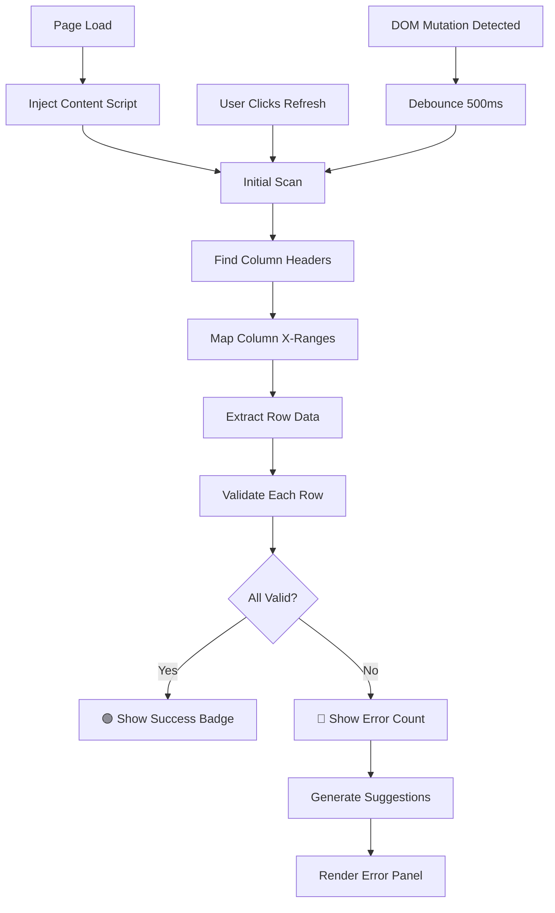

# 🧠 Brainstorm: NanoPro Invoice Calculation Validator

> **Date:** 2026-02-02
> **Status:** Requirements Gathered ✅

---

## 📋 Problem Statement

Build a **Chrome/Edge browser extension** that validates invoice line item calculations on Nanonets review pages:

```
quantity × item_price = line_amount
```

The extension must:
- Verify all visible line item calculations
- Detect incorrect rows and explain discrepancies
- Suggest **3 possible corrections** (assuming any one column could be wrong)
- Operate **read-only** — no modification to Nanonets DOM or scripts
- Re-validate on manual refresh button click

---

## ✅ Confirmed Requirements

| Requirement | User Answer |
|-------------|-------------|
| **Table structure stable?** | Yes, structure doesn't change |
| **Column names fixed?** | Yes, names are fixed (e.g., "Qty", "Item_Price", "Line_Amount") |
| **Column positions fixed?** | No, positions can vary |
| **Other views exist?** | No, only table view |
| **Validation trigger** | **Hybrid** — Auto on load + manual refresh button |
| **Smart suggestions** | Yes, assume any column could be wrong, suggest 3 corrections |
| **Pattern inference** | Yes, learn from valid rows |
| **Edge cases priority** | Multiple rows/lines per invoice |
| **UI placement** | **Floating badge at top-center** |

---

## 🏗️ Architecture Options

### Option A: Simple Table Parser (Column Header Matching)

**Description:** 
Find column headers by text content ("Qty", "Item_Price", "Line_Amount"), then read corresponding column data using DOM structure (table cells in same column index).

```
┌─────────────────────────────────────────────┐
│  Find Headers by Text → Get Column Index    │
│  ↓                                          │
│  For Each Row: Read Cells by Column Index   │
│  ↓                                          │
│  Parse Numbers → Validate → Generate Report │
└─────────────────────────────────────────────┘
```

✅ **Pros:**
- Simple implementation
- Fast execution
- Easy to debug

❌ **Cons:**
- Relies on table DOM structure (`<table>`, `<tr>`, `<td>`)
- May break if Nanonets uses divs/flexbox instead of tables

📊 **Effort:** Low

---

### Option B: Geometry-Based Detection (Position Mapping)

**Description:**
Use `getBoundingClientRect()` to detect column positions from headers, then group numeric values by their X-axis alignment.

```
┌─────────────────────────────────────────────┐
│  Find Headers → Record X-axis Ranges        │
│  ↓                                          │
│  Scan All Numbers → Map to Column by X-pos  │
│  ↓                                          │
│  Group by Y-axis (Rows) → Validate          │
└─────────────────────────────────────────────┘
```

✅ **Pros:**
- Works regardless of DOM structure (tables, divs, spans, etc.)
- Resilient to CSS class name changes
- Matches the visual layout users see

❌ **Cons:**
- More complex implementation
- Needs viewport handling for scrollable content
- Slight performance overhead

📊 **Effort:** Medium

---

### Option C: Hybrid Detection (Header-First + Geometry Fallback)

**Description:**
Try table structure first (Option A). If table structure not found, fall back to geometry-based detection (Option B).

```
┌─────────────────────────────────────────────┐
│  Attempt Table Structure Parsing            │
│  ↓                                          │
│  Success? → Use Table Parser                │
│  Failed? → Fall back to Geometry Detection  │
│  ↓                                          │
│  Unified Validation Pipeline                │
└─────────────────────────────────────────────┘
```

✅ **Pros:**
- Best of both worlds
- Maximum compatibility
- Graceful degradation

❌ **Cons:**
- Most complex implementation
- Two code paths to maintain

📊 **Effort:** High

---

## 💡 Recommendation

**Option B: Geometry-Based Detection** — Because:

1. **Nanonets UI is React-based** — likely uses divs, not native `<table>` elements
2. **Column positions vary** — geometry detection handles this naturally
3. **Visual accuracy** — we extract exactly what the user sees
4. **Future-proof** — survives UI redesigns as long as layout stays similar

---

## 🧮 Calculation Suggestion Engine

When a row is **invalid** (`qty × price ≠ amount`), generate **3 suggestions**:

### Suggestion Strategy

For an invalid row with values `(Q, P, A)` where `Q × P ≠ A`:

| Suggestion | Assumption | Corrected Value |
|------------|------------|-----------------|
| **1. Fix Amount** | Q and P are correct | `correct_amount = Q × P` |
| **2. Fix Quantity** | P and A are correct | `correct_qty = A ÷ P` |
| **3. Fix Price** | Q and A are correct | `correct_price = A ÷ Q` |

### Confidence Scoring

Each suggestion gets a **confidence score** based on:

1. **Plausibility** — Is the corrected value reasonable? (e.g., qty of 0.5 unlikely for most items)
2. **Pattern match** — Does it match patterns from valid rows? (e.g., most prices are $5.00)
3. **Magnitude** — How different is the correction from original? (smaller delta = higher confidence)

```
Confidence = PatternMatch × 0.4 + Plausibility × 0.3 + ProximityScore × 0.3
```

---

## 🎨 UI Design: Floating Badge (Top-Center)

### States

```
┌─────────────────────────────────────────────┐
│                                             │
│   🟢 "4/4 Valid"     ← All calculations OK  │
│                                             │
│   🔴 "2 Errors"      ← Click to expand      │
│                                             │
│   ⚠️ "Incomplete"    ← Missing data         │
│                                             │
│   🔄 "Validating..." ← Processing           │
│                                             │
└─────────────────────────────────────────────┘
```

### Expanded Error Panel

```
┌─────────────────────────────────────────────────────────────┐
│  NanoPro Validator                              [🔄] [✕]   │
├─────────────────────────────────────────────────────────────┤
│                                                             │
│  Row 2: ❌ INVALID                                          │
│  ┌─────────────────────────────────────────────────────┐    │
│  │ Qty: 2  ×  Price: 5.00  =  50.00 (shown)            │    │
│  │                            10.00 (expected)         │    │
│  └─────────────────────────────────────────────────────┘    │
│                                                             │
│  💡 Suggestions:                                            │
│  ├─ ⭐ Amount should be 10.00       (95% confidence)        │
│  ├─ ○  Qty should be 10             (40% confidence)       │
│  └─ ○  Price should be 25.00        (35% confidence)       │
│                                                             │
│  Row 3: ❌ INVALID                                          │
│  ...                                                        │
│                                                             │
└─────────────────────────────────────────────────────────────┘
```

### UI Requirements

- **Shadow DOM** — Encapsulated styles, no CSS leakage
- **Fixed position** — `top: 10px; left: 50%; transform: translateX(-50%)`
- **Draggable** — User can reposition if needed
- **Collapsible** — Minimize to badge when not reviewing errors
- **Refresh button** — Manual re-validation trigger

---

## 📁 Proposed File Structure

```
NanoPro_extension/
├── manifest.json           # MV3 extension manifest
├── src/
│   ├── content/
│   │   ├── index.js        # Main content script entry
│   │   ├── scanner.js      # DOM scanner & column mapper
│   │   ├── validator.js    # Calculation validation logic
│   │   ├── suggester.js    # Smart suggestion engine
│   │   └── observer.js     # MutationObserver handler
│   ├── ui/
│   │   ├── overlay.js      # Shadow DOM overlay manager
│   │   ├── badge.js        # Floating badge component
│   │   ├── panel.js        # Error panel component
│   │   └── styles.css      # Encapsulated styles
│   └── utils/
│       ├── parser.js       # Number parsing utilities
│       └── geometry.js     # Bounding rect helpers
├── icons/
│   ├── icon16.png
│   ├── icon48.png
│   └── icon128.png
└── README.md               # Documentation
```

---

## 🔄 Validation Flow



---

## ⚡ Performance Considerations

| Concern | Mitigation |
|---------|------------|
| DOM scanning overhead | Cache column positions, only rescan on refresh |
| MutationObserver spam | Debounce with 500ms delay |
| Large invoices (100+ rows) | Virtual scrolling awareness, scan visible + buffer |
| Re-renders | Diff-based UI updates, not full rerender |

---

## 🛡️ Safety Guarantees

1. **Read-only** — Never modify Nanonets DOM
2. **No event hijacking** — No listeners on Nanonets inputs
3. **Isolated UI** — Shadow DOM prevents style conflicts
4. **Deterministic** — All math is explainable
5. **Fail-safe** — If uncertain, show ⚠️ warning, never false ✅

---

## 📝 Next Steps

1. [ ] Create implementation plan (`implementation_plan.md`)
2. [ ] Set up extension boilerplate (Manifest V3)
3. [ ] Implement geometry-based scanner
4. [ ] Build validation engine with suggestion generator
5. [ ] Create Shadow DOM overlay UI
6. [ ] Add MutationObserver + debounce
7. [ ] Test on real Nanonets pages
8. [ ] Write README documentation

---

## ❓ Open Questions (For Later)

- Should the extension work on other invoice platforms beyond Nanonets?
- Do we need a settings/options page for customization?
- Should we persist validation history across sessions?
